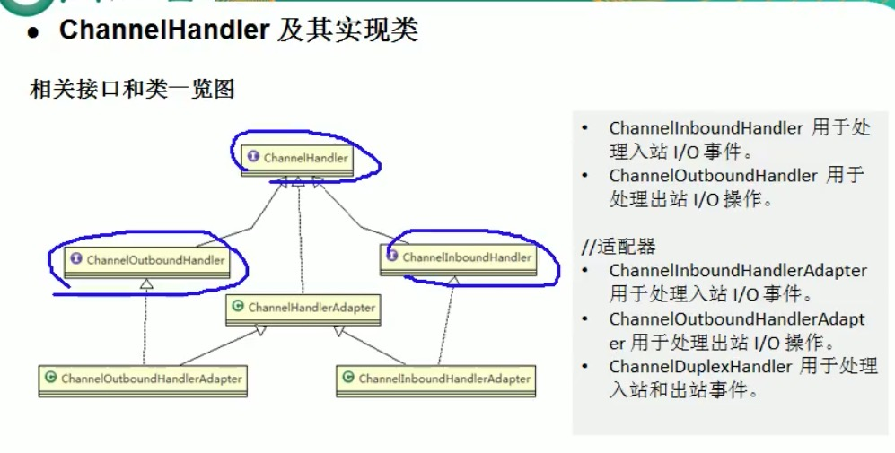

Netty核心模块

## 1、Bootstrap、ServerBootstrap

Bootstrap意思是引导，一个Netty应用通常是由一个Bootstrap开始，主要作用是配置整个Netty程序,串联各个组件，Netty中Bootstrap类是客户端程序的启动引导类，ServerBootstrap是服务端的启动引导类。handler方法是给boosgroup添加handler,childHandler方法是给workhandler添加handler.

## 2、Channel

* Netty网络通信的组件,能够用于执行网络I/O

* 通过channel可获得当前网络连接的通道的状态、网络连接配置参数

* Channel提供异步的网络I/O操作(如建立连接、读写、绑定端口)，异步调用意味着任何的I/O调用立刻返回，并不保证调用结束返回时所请求的I/O操作已经完成

* 调用立刻返回一个ChannelFuture实例，通过注册侦听到ChannelFuture上，可以获取I/O操作成功、失败通知

* 不同协议，不同的阻塞类型的连接都有不同的Channel类型与之对应，常用的Channel类型

  ```pr
  NioSocketChannel:异步的客户端TCP Socket连接
  NioServerSocketChannel:异步的服务器端TCP Socket连接
  NioDatagramChannel:异步的UDP连接
  NioSctpChannel:异步的客户端Sctp连接
  NioSctpServerChannel:异步的Sctp服务端连接，这些通道涵盖了UDP和TCP网络IO以及文件IO
  ```

## 3、Selector

* Netty基于Selector对象实现I/O多路复用，通过Selector一个线程可以监听多个连接的Channel事件
* 当向一个Selector中注册Channel后，Selector内部机制就可以自动不断的查询这些注册的Channel是否有已经就绪的I/O事件（可读、可写、网络连接等),这样程序就可以很简单的使用一个线程高效的管理多个Channel

## 4、ChannelHandler

* ChannelHandler是一个接口，处理I/O事件或拦截I/O操作，并将其转发到其ChannelPipeline(业务处理链)中下一个handler处理

* ChannelHandler本身并没有提供很多方法，因为这个接口有许多的方法需要实现，方法使用期间，可以继承它的子类

* ChannelHandler相关接口和类

  

  

5、Pipeline和ChannelPipeline

每个Channel都有且仅有一个ChannelPipeline与之对应


