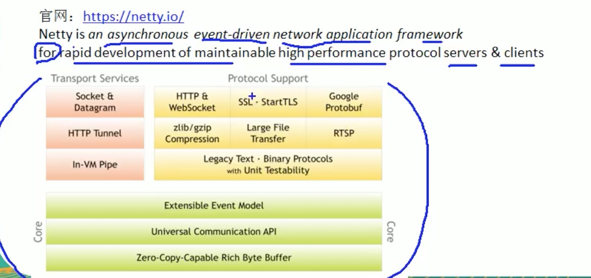
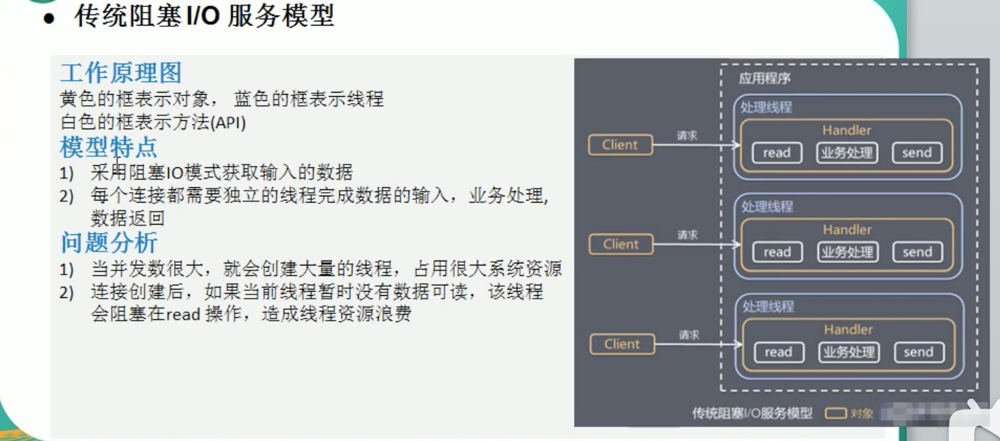

## 1、原生NIO存在的问题

* NIO的类库和API复杂，使用麻烦，需要熟练掌握Selector,ServerSocketChannel、SocketChannel、ByteBuffer等
* 需要具备其它的额外技能，需要熟悉java多线程编程，因为NIO编程涉及到Reactor模式，你必须对多线程和网络编程非常熟悉，才能编写出高质量的NIO程序
* 开发工作量和难度非常大，例如处理客户端断连、重连、网络闪断、半包读写、失败缓存、网络拥塞和异常流的处理等等
* JDK NIO的bug,例如臭名昭著的Epool bug,他会导致Selector空轮询，最终导致cpu 100%,直到JDK1.7版本该问题依旧存在，么有被根本解决。

## 2、Netty说明

## 3、线程模型基本介绍

* 传统阻塞IO服务模型

  

* Reacto模型

  一般称为反应器模式、分发者模式（dispatcher)、通知者模式(notifier)

Reactor模式中核心组成：

* Reactor 在一个单独的线程中运行，负责监听和分发事件，分发给适当的处理程序来对IO事件作出反应，它就像公司的电话接线员，它接听来自客户端的电话并将线路转移到适当的联系人
* Handlers:处理执行I/O事件要完成的实际事件，类似于客户想要与之交谈的公司中的实际人员，Reactor通过调度适当的处理程序来响应I/O事件，处理程序执行非阻塞操作。

Reactor模式分类

根据Reactor的数量和处理资源线程池的数量不通，有3中典型的实现

* 单Reactor单线程
* 单Reactor多线程
* 主从Reactor多线程(netty)

## 4、netty模型

